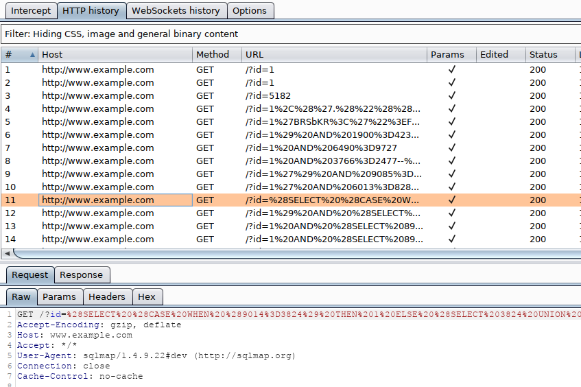

# Handling SQLMap Errors

We may face many problems when setting up SQLMap or using it with HTTP requests. In this section, we will discuss the recommended mechanisms for finding the cause and properly fixing it.

***

### Display Errors

The first step is usually to switch the `--parse-errors`, to parse the DBMS errors (if any) and displays them as part of the program run:

Handling SQLMap Errors

```shell-session
...SNIP...
[16:09:20] [INFO] testing if GET parameter 'id' is dynamic
[16:09:20] [INFO] GET parameter 'id' appears to be dynamic
[16:09:20] [WARNING] parsed DBMS error message: 'SQLSTATE[42000]: Syntax error or access violation: 1064 You have an error in your SQL syntax; check the manual that corresponds to your MySQL server version for the right syntax to use near '))"',),)((' at line 1'"
[16:09:20] [INFO] heuristic (basic) test shows that GET parameter 'id' might be injectable (possible DBMS: 'MySQL')
[16:09:20] [WARNING] parsed DBMS error message: 'SQLSTATE[42000]: Syntax error or access violation: 1064 You have an error in your SQL syntax; check the manual that corresponds to your MySQL server version for the right syntax to use near ''YzDZJELylInm' at line 1'
...SNIP...
```

With this option, SQLMap will automatically print the DBMS error, thus giving us clarity on what the issue may be so that we can properly fix it.

***

### Store the Traffic

The `-t` option stores the whole traffic content to an output file:

Handling SQLMap Errors

```shell-session
AIceBear@htb[/htb]$ sqlmap -u "http://www.target.com/vuln.php?id=1" --batch -t /tmp/traffic.txt

AIceBear@htb[/htb]$ cat /tmp/traffic.txt
HTTP request [#1]:
GET /?id=1 HTTP/1.1
Host: www.example.com
Cache-control: no-cache
Accept-encoding: gzip,deflate
Accept: */*
User-agent: sqlmap/1.4.9 (http://sqlmap.org)
Connection: close

HTTP response [#1] (200 OK):
Date: Thu, 24 Sep 2020 14:12:50 GMT
Server: Apache/2.4.41 (Ubuntu)
Vary: Accept-Encoding
Content-Encoding: gzip
Content-Length: 914
Connection: close
Content-Type: text/html; charset=UTF-8
URI: http://www.example.com:80/?id=1

<!DOCTYPE html>
<html lang="en">
...SNIP...
```

As we can see from the above output, the `/tmp/traffic.txt` file now contains all sent and received HTTP requests. So, we can now manually investigate these requests to see where the issue is occurring.

***

### Verbose Output

Another useful flag is the `-v` option, which raises the verbosity level of the console output:

Handling SQLMap Errors

```shell-session
AIceBear@htb[/htb]$ sqlmap -u "http://www.target.com/vuln.php?id=1" -v 6 --batch
        ___
       __H__
 ___ ___[,]_____ ___ ___  {1.4.9}
|_ -| . [(]     | .'| . |
|___|_  [(]_|_|_|__,|  _|
      |_|V...       |_|   http://sqlmap.org


[*] starting @ 16:17:40 /2020-09-24/

[16:17:40] [DEBUG] cleaning up configuration parameters
[16:17:40] [DEBUG] setting the HTTP timeout
[16:17:40] [DEBUG] setting the HTTP User-Agent header
[16:17:40] [DEBUG] creating HTTP requests opener object
[16:17:40] [DEBUG] resolving hostname 'www.example.com'
[16:17:40] [INFO] testing connection to the target URL
[16:17:40] [TRAFFIC OUT] HTTP request [#1]:
GET /?id=1 HTTP/1.1
Host: www.example.com
Cache-control: no-cache
Accept-encoding: gzip,deflate
Accept: */*
User-agent: sqlmap/1.4.9 (http://sqlmap.org)
Connection: close

[16:17:40] [DEBUG] declared web page charset 'utf-8'
[16:17:40] [TRAFFIC IN] HTTP response [#1] (200 OK):
Date: Thu, 24 Sep 2020 14:17:40 GMT
Server: Apache/2.4.41 (Ubuntu)
Vary: Accept-Encoding
Content-Encoding: gzip
Content-Length: 914
Connection: close
Content-Type: text/html; charset=UTF-8
URI: http://www.example.com:80/?id=1

<!DOCTYPE html>
<html lang="en">

<head>
  <meta charset="utf-8">
  <meta name="viewport" content="width=device-width, initial-scale=1, shrink-to-fit=no">
  <meta name="description" content="">
  <meta name="author" content="">
  <link href="vendor/bootstrap/css/bootstrap.min.css" rel="stylesheet">
  <title>SQLMap Essentials - Case1</title>
</head>

<body>
...SNIP...
```

As we can see, the `-v 6` option will directly print all errors and full HTTP request to the terminal so that we can follow along with everything SQLMap is doing in real-time.

***

### Using Proxy

Finally, we can utilize the `--proxy` option to redirect the whole traffic through a (MiTM) proxy (e.g., `Burp`). This will route all SQLMap traffic through `Burp`, so that we can later manually investigate all requests, repeat them, and utilize all features of `Burp` with these requests:

<figure><figcaption></figcaption></figure>
